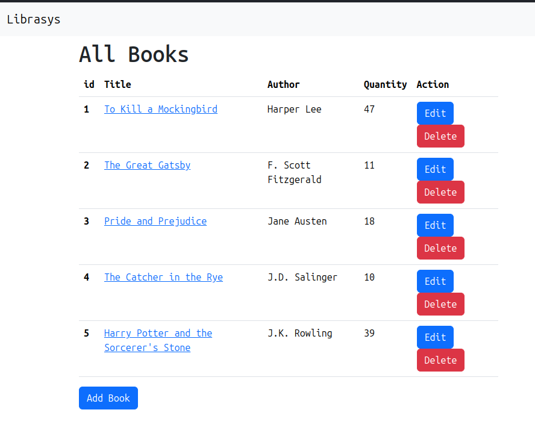
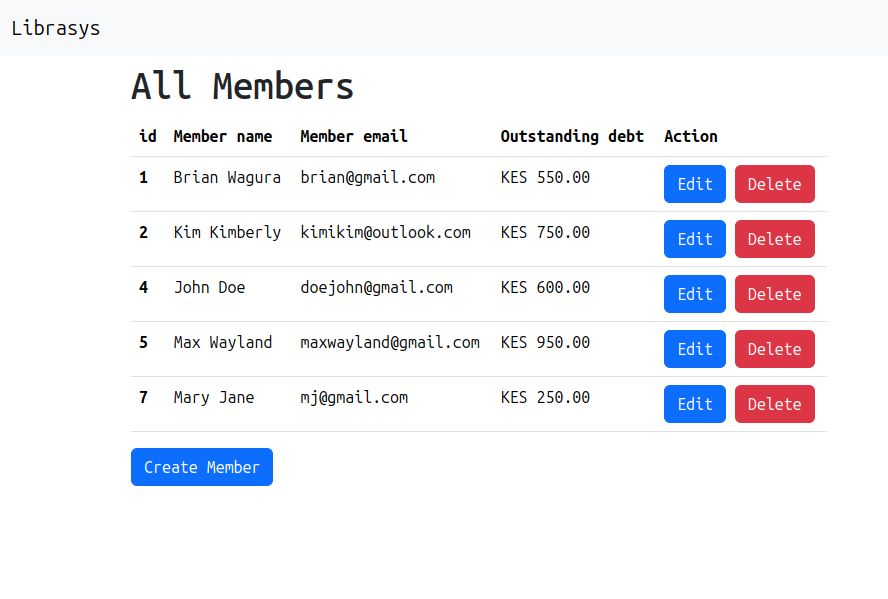
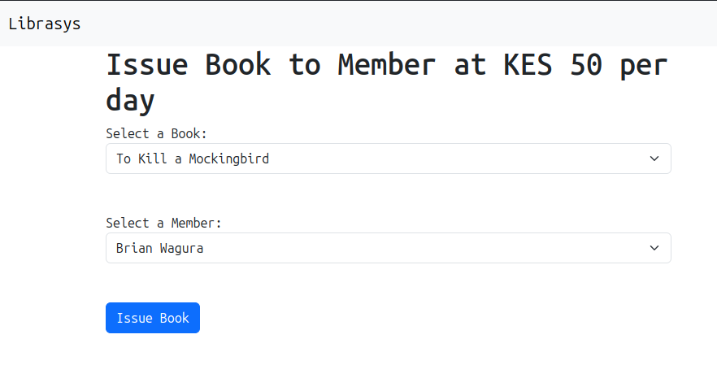
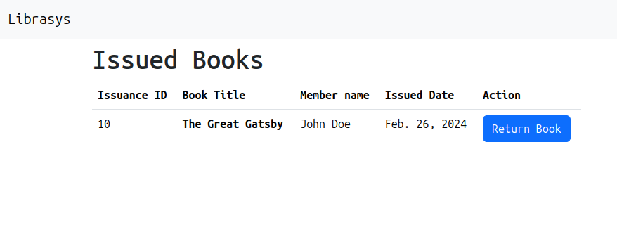
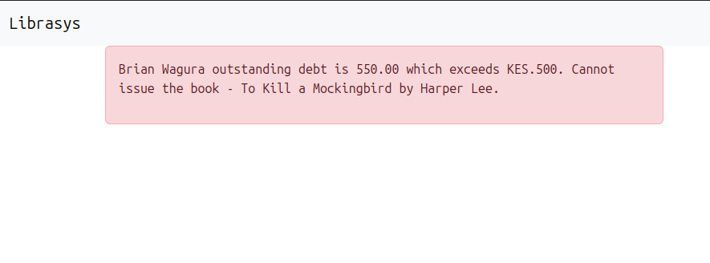
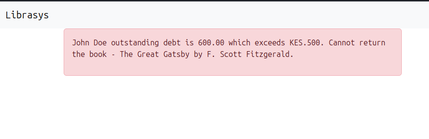

# Librasys - Library Management Web Application
This is a simple web application designed to assist librarians in managing their library efficiently.
It allows librarians to track books, manage inventory, handle member transactions, and ensure smooth 
operations within the library.

## Features
- CRUD Operations: Librarians can perform Create, Read, Update, and Delete operations on Books and Members.
- Book Issuance: Librarians can issue books to members.
- Book Returns: Librarians can process book returns from members.
- Search Functionality: Librarians can search for books by name and author.
- Rent Fee: Librarians can charge a rent fee on book returns.
- Debt Limit: A member's outstanding debt cannot exceed KES. 500.

## Technologies Used
### Frontend
- HTML
- CSS
- Bootstrap
- JavaScript

### Backend
- Python - Django Web Framework
- PostgreSQL Database

## Screenshots
 Create, Read, Update and Delete books.

 Create, Read, Update and Delete members.

 Issue Books to members.

 Issued Books to Members.

 Debt exceeds 500, Cannot borrow book.

 Debt exceeds 500, Cannot return book.

